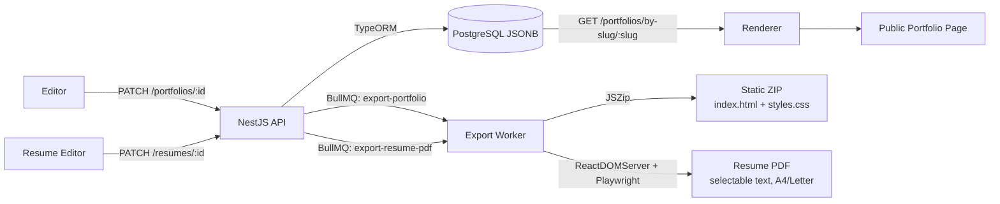
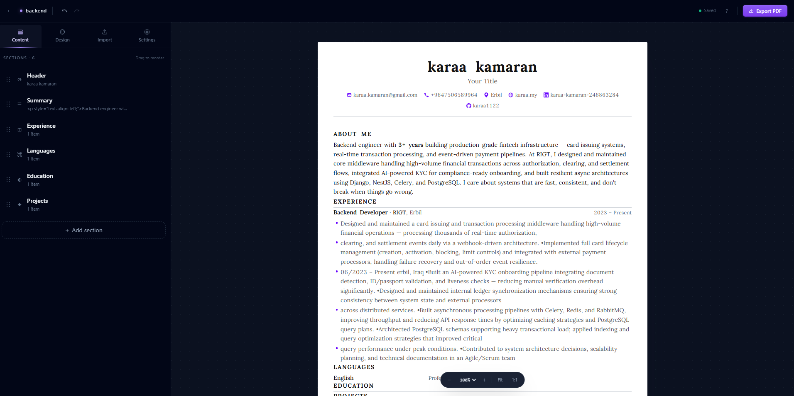

<div align="center">

# DevFolio

**Portfolio + ATS-friendly resume builder for developers who have been meaning to update both since 2019.**

Build them once. Publish your portfolio in minutes. Export a print-perfect PDF resume. Never touch a CSS file again.


<br/>


</div>

---

## What Is This?

DevFolio is a **visual portfolio + resume editor** for developers. You log in, drag sections around, pick a theme, write your bio, and publish. Your portfolio gets a public URL. Your resume exports to a print-perfect PDF that survives ATS parsers. Done. It's almost suspicious how simple that is.

No Webflow subscription. No WordPress plugin hell. No Word document that breaks every time you change a bullet. No "I'll update my portfolio and resume this weekend" for the 47th weekend in a row.

**Key ideas:**
- Both portfolio and resume are stored as **JSON objects** in the database — no HTML stored, ever
- The editor is a live preview — what you see is literally what gets rendered publicly (or printed to PDF)
- **Portfolio** → publish to a public URL, or export to a static **ZIP file** (HTML + CSS) and host it anywhere for free
- **Resume** → 6 templates, 6 skill layouts, server-side Chromium PDF export with selectable text and ATS-safe mode
- Connect GitHub to auto-import your repos as portfolio projects
- Tiptap-powered rich text editor for summaries and bullets — bold, italic, underline, lists, links, alignment

---

## Why DevFolio?

Most portfolio tools make you choose between control and convenience. You either get a drag-and-drop builder that locks you in forever, or a blank HTML file and a prayer. Resume tools are even worse — pay $10/month to download a single PDF, or fight Word for 4 hours just to align two columns.

DevFolio gives you both, in one app. Edit visually. Own your data. Export anytime. Your career documents should not require emotional recovery to update.

| Pain | DevFolio |
|---|---|
| "I need to re-deploy every time I change a typo" | Auto-save + instant publish |
| "My portfolio is stuck on some platform I can't leave" | Export to static ZIP, host anywhere |
| "Setting up a portfolio takes a whole weekend" | Running in under 10 minutes |
| "I have to update my GitHub AND my portfolio separately" | GitHub integration syncs repos automatically |
| "I need a different resume for every job application" | Duplicate a resume in one click, tweak per role |
| "My resume looks great on screen, broken in the PDF" | Same renderer for preview and Chromium-rendered PDF — pixel-perfect |
| "ATS parsers eat my fancy two-column resume alive" | One-click ATS mode → single column, system font, parser-friendly |

---

## Screenshots

<table>
  <tr>
    <td><strong>Sign Up</strong></td>
    <td><strong>Login</strong></td>
  </tr>
  <tr>
    <td></td>
    <td></td>
  </tr>
  <tr>
    <td><strong>Onboarding</strong></td>
    <td><strong>Profile</strong></td>
  </tr>
  <tr>
    <td></td>
    <td></td>
  </tr>
  <tr>
    <td><strong>Editor</strong></td>
    <td><strong>Live Portfolio</strong></td>
  </tr>
  <tr>
    <td></td>
    <td></td>
  </tr>
</table>

---

## Architecture

```
devfolio/
├── apps/
│   ├── api/              NestJS REST API            → :3001
│   └── web/              Next.js 14 frontend        → :3000
├── packages/
│   ├── shared/           Zod schemas + TS types
│   └── renderer/         React portfolio renderer
├── workers/
│   └── export/           BullMQ static export worker
├── docker-compose.yml    Full stack (prod-like)
├── docker-compose.dev.yml  Dev stack (DB + Redis only)
└── .env.example          Start here
```

## Tech Stack

| Layer | Technology |
|---|---|
| **Frontend** | Next.js 14 (App Router), React 18, Tailwind CSS |
| **Editor state** | Zustand + zundo (50-step undo/redo) + @dnd-kit drag & drop |
| **Rich text** | Tiptap 3 (ProseMirror) — bold/italic/underline/lists/links/alignment, stored as sanitized HTML |
| **Backend** | NestJS 10, TypeORM, PostgreSQL (JSONB), class-validator |
| **Auth** | JWT access + refresh tokens in httpOnly cookies, bcrypt, GitHub OAuth via Passport.js |
| **Cache** | Redis + cache-manager (portfolio pages cached 5 min) |
| **Queue** | BullMQ — portfolio ZIP + resume PDF jobs, retry logic, concurrency control |
| **Portfolio export** | JSZip — self-contained HTML+CSS ZIP on-demand |
| **Resume export** | Playwright + headless Chromium — server-rendered React → PDF with selectable text |
| **Sanitization** | sanitize-html — whitelisted-tag HTML rendering for user-authored rich text |
| **Monorepo** | pnpm workspaces + Turborepo |
| **Containers** | Docker + Docker Compose |

---

## ✨ Why JSON?

Most portfolio tools store HTML in the database. DevFolio stores a single **JSONB object** per portfolio AND per resume. This is a deliberate architectural choice with real consequences:

**Renderer independence.** The JSON schema is the contract. The renderer (`packages/renderer`) is a separate React package that consumes it — same package powers both the live editor preview and the headless-Chromium PDF worker. Want a completely different visual style? Swap the renderer — the data doesn't move.

**Export portability.** Because your portfolio is data, not markup, the export worker can render it to any target format. Portfolio → static HTML+CSS ZIP. Resume → PDF (via Chromium), HTML, or eventually DOCX. The same data fuels every output.

**Schema validation.** Every portfolio write is validated against a Zod schema before it touches the database. Malformed data cannot enter the system — the schema is the single source of truth for both the API and the frontend.

**Future template support.** Switching templates will never require migrating your content. The data stays the same; only the renderer changes. Your bio doesn't care what font stack you're using.

**Simpler queries.** A portfolio is one row. Loading it is one query. The JSONB column gives you structured access and PostgreSQL indexing without a deeply normalized schema that requires six joins to render a page.

---

## 🏗 Rendering Flow



**Request path for a public portfolio visit:**
1. Browser hits `devfolioapp.cloud/your-slug`
2. Next.js SSR fetches portfolio JSON from the API
3. The `@devfolio/renderer` package renders it to React
4. Redis cache serves repeat visitors without hitting the database

**Request path for a resume PDF export:**
1. User clicks Export PDF in the editor
2. API flushes any in-flight autosave, then enqueues a `export-resume-pdf` BullMQ job
3. Worker reads the resume JSON, server-renders it with `@devfolio/renderer` (same React tree as the editor preview), boots headless Chromium via Playwright, prints to PDF with `@page` rules driving margins and pagination
4. PDF lands in `uploads/`, the editor polls until the job finishes and serves the download link

---

## Features

### Editor


- **Drag & drop sections** — reorder your Hero, About, Projects, Skills, Experience, Education, Contact sections
- **Live preview** — toggle between Edit and Preview mode; same renderer as the public page
- **Undo / Redo** — 50 steps, powered by zundo temporal middleware
- **Auto-save** — saves 2 seconds after your last keystroke, like a good editor should
- **Theme panel** — 6 presets, per-color overrides, 5 fonts, border radius, spacing

### Portfolio Sections

| Section | What goes in it |
|---|---|
| **Hero** | Name, title, subtitle, bio, location, "available for work" badge |
| **About** | Long-form bio, highlights list |
| **Projects** | Grid / list / masonry layout, tags, live URL, repo URL, featured flag |
| **Skills** | Tags / bars / grid layout, proficiency levels, categories |
| **Experience** | Timeline or cards, company, role, dates, description |
| **Education** | Institution, degree, field, GPA |
| **Contact** | Email, location, GitHub / LinkedIn / Twitter socials |

### Publishing & Export
- **One-click publish** — your portfolio becomes live at `yourdomain.com/your-slug`
- **Export to ZIP** — self-contained `index.html` + `styles.css`, host on Netlify, GitHub Pages, or a USB stick
- **GitHub integration** — connect once, import repos as portfolio projects with stars, language, and description

### Analytics
- Page view tracking on every public portfolio visit
- Dashboard shows total views, unique visitors, views-per-day sparkline

---

## 📄 Resume Builder

A full second product, in the same app, on the same data layer. Tailor a separate resume per application — each one exports to a print-perfect PDF that recruiters AND ATS parsers can both read.



### Editor

- **Click-to-edit modal** for prose fields (FlowCV-style) with a full toolbar — **B / I / U / S**, **bulleted + numbered lists**, **link**, **left / center / right / justify alignment**
- **Inline rich text** per bullet row (Tiptap, no modal needed for one-liners)
- **Drag & drop** to reorder sections and items
- **Per-section show/hide** with one click
- **Duplicate section** for similar entries (two roles at the same company, etc.)
- **Auto-save** with a save indicator that turns red and shows the error if the API rejects your edit
- **50-step undo/redo** (Ctrl+Z / Ctrl+Shift+Z)
- **Ctrl+S** flushes the autosave immediately
- **Live multi-page paginator** — the canvas shows real A4 / Letter page breaks as you type
- **Zoom controls** — 50% / 75% / 100% / 125% / 150% + page indicator + 1:1 + Fit

### Templates (6)

| Template | Best for |
|---|---|
| **Classic** | The recruiter-default. Centered name, single column, accent rule under each section |
| **Modern** | Accent bar on the left of section headings, oversized name, accent-colored role titles |
| **Compact** | Senior people with 10+ years to fit on one page — tighter line-height, ~30% denser |
| **Sidebar** | Two columns with an accent-tinted left rail for skills / languages / certs |
| **Two-column** | Centered header, 60/40 split — chronological narrative left, supporting material right |
| **Dev Focus** | Monospace headings with `>` prefix, bordered tech chips, dashed rule under header |

### Skill layouts (6)

The skills section reshapes itself based on what's selected — same data, six visual modes:

| Layout | Looks like |
|---|---|
| **Grouped** | `Category | comma-separated skills` — classic resume style |
| **Tags** | Bordered chips grouped under each category |
| **Bars** | Skill name + filled progress bar (uses level when present) |
| **Compact** | One long inline run separated by dots — most space-efficient |
| **Grid** | Two-column card grid with accent-color category titles |
| **Minimal** | `Category: skill, skill, skill` — pure text, optimised for ATS parsers |

### Resume sections

| Section | What goes in it |
|---|---|
| **Header** | Name, title, email, phone, location, website, GitHub / LinkedIn / X / dev.to / Stack Overflow / portfolio — rendered as brand-icon contact rows |
| **Summary** | 2–3 sentences of rich text |
| **Experience** | Role, company, location, dates (current toggle), summary, rich-text bullets, technologies |
| **Projects** | Name, tagline, live + repo URLs, year, bullets, technologies |
| **Education** | Institution, degree, field, location, dates, GPA, details |
| **Skills** | Grouped categories with drag-to-reorder, drag chip skills, 6 render layouts |
| **Certifications** | Name, issuer, date, expiry, credential ID, URL |
| **Awards** | Name, issuer, date, description |
| **Languages** | Name + proficiency (elementary → native), rendered as a two-column grid |
| **Custom** | Free-form section for Publications, Volunteering, Speaking, anything you need |

### Design controls

- **6 templates** — switch live, swap any time
- **10 accent presets** + full custom color picker
- **6 fonts** — Inter, Source Sans, IBM Plex, Lora, Merriweather, JetBrains Mono
- **4 sizes** × **3 line heights** × **3 density modes** (compact / normal / relaxed)
- **A4 / Letter** page format, **narrow / normal / wide** margins
- **ATS-safe mode** — one toggle forces single-column, system font, pure black text, no accent bars, no two-column layouts

### Export

- **Server-rendered PDF** — same React renderer as the editor preview, rendered to HTML server-side, printed via headless Chromium through Playwright
- **Selectable text + clickable links** in the PDF (not a screenshot)
- **Real `@page` pagination** — Chromium handles page breaks via CSS `break-inside: avoid`
- **Background colors, accent rules, and brand icons preserved** in the output
- **Browser-print fallback** — if the worker is down, one click opens your OS print dialog on the live preview
- **Save-before-export** — the editor force-flushes any in-flight autosave before queueing the export, so the worker never reads stale data
- **Clear error states** — failures surface the actual reason ("worker offline", "outdated docker image", etc.) instead of hanging on "Preparing…"

### Multi-resume management

- **Unlimited resumes** per account — one for each role or company type
- **Duplicate** a resume in one click (set new slug + title), then tweak the bullets to match the job description
- **Resume list** at `/resume` with previews of template, section count, target role, last-updated date
- **Dashboard surfacing** — your six most-recent resumes appear as compact cards on the dashboard alongside your portfolios

---

## 🧠 Design Philosophy

DevFolio is built around one idea: **developers should own their portfolio data.**

- **No vendor lock-in.** Export your portfolio as a static ZIP at any time. Host it on Netlify, GitHub Pages, S3, a Raspberry Pi, a USB stick — we genuinely don't mind.
- **Portable by design.** The JSON schema is open. If you want to build your own renderer or template, the data contract is documented and stable.
- **Open-source first.** The entire stack is MIT licensed. Self-host it, fork it, modify it. You don't need our servers.
- **Developers own their content.** Your bio, your projects, your experience — they live in a database you control. No "export request" forms. No waiting 30 days for a ZIP file.
- **Simplicity over features.** A portfolio tool that requires a PhD to configure defeats the purpose. Every feature in DevFolio exists because it removed friction, not added it.

---

## 🚀 Deployment

DevFolio ships as a fully containerized application. One `docker compose up` and everything is running.

| Target | How |
|---|---|
| **Local dev** | `docker compose -f docker-compose.dev.yml up -d` (DB + Redis only, run apps with `pnpm dev`) |
| **Self-hosted VPS / AWS EC2** | `docker compose up --build -d` — full stack in containers |
| **Static portfolio export** | Export ZIP → deploy to Netlify, Vercel, GitHub Pages, or any static host |

The production compose file includes health checks, restart policies, and structured JSON logging out of the box. No extra configuration needed to get a production-grade deployment.

---

## Prerequisites

Before you start, make sure you have:

- **Node.js** ≥ 20 — [nodejs.org](https://nodejs.org)
- **pnpm** ≥ 9 — `npm install -g pnpm`
- **Docker** — [docker.com](https://www.docker.com/products/docker-desktop) (for PostgreSQL + Redis)

That's it. No weird system dependencies. No global NestJS CLI required. You're welcome.

---

## Quick Start (Local Development)

### Step 1 — Clone and install

```bash
git clone https://github.com/karaa1122/DevFolio.git
cd DevFolio
pnpm install
```

### Step 2 — Set up environment variables

```bash
cp .env.example .env
```

Open `.env` and fill in at minimum:

```env
# Generate with: node -e "console.log(require('crypto').randomBytes(64).toString('hex'))"
JWT_SECRET=<64 hex chars>
JWT_REFRESH_SECRET=<different 64 hex chars>

# Required in production — safe to leave as-is for local dev
IP_HASH_SALT=<32 hex chars>
ENCRYPTION_KEY=<64 hex chars>

# Everything else (database URL, Redis, ports) works out of the box with Docker
```

> **GitHub OAuth is optional** — the app works fine without it. You only need it if you want the "Connect GitHub" feature. See [GitHub OAuth setup](#github-oauth-setup) below.

### Step 3 — Start the database and Redis

```bash
docker compose -f docker-compose.dev.yml up -d
```

This starts PostgreSQL on port `5432` and Redis on port `6379`.

### Step 4 — Run migrations

```bash
pnpm --filter @devfolio/api migration:run
```

Run this once on first setup, and again whenever you pull changes that include new migration files.

### Step 5 — Run everything

```bash
pnpm dev
```

Turborepo starts all services in parallel:

| Service | URL | What it is |
|---|---|---|
| **Web App** | http://localhost:3000 | The frontend — start here |
| **API** | http://localhost:3001/api/v1 | REST API |
| **Swagger** | http://localhost:3001/api/docs | Interactive API docs |
| **Export Worker** | (background) | Processes export jobs from BullMQ |

### Step 6 — Create your account

1. Go to http://localhost:3000
2. Click **Register** — fill in name, email, password
3. You're in. Create a portfolio, pick a slug, start building. The personal brand era begins.

---

## Full Docker Setup (Production-like)

If you want everything in containers — API, web, worker, database, Redis — all at once:

```bash
cp .env.example .env
# Edit .env — set proper secrets and your domain URLs

docker compose up --build -d
```

All services start with health checks and restart policies. The web app will be at http://localhost:3000.

**Run migrations after the first build:**

```bash
docker compose exec api node dist/database/migrate.js
```

```bash
docker compose logs -f api           # API logs (structured JSON)
docker compose logs -f web           # Next.js logs
docker compose logs -f export-worker # Export worker logs

docker compose down      # Stop everything
docker compose down -v   # Stop + wipe database volumes
```

---

## GitHub OAuth Setup

GitHub OAuth is optional but enables the "Connect GitHub → import repos" feature.

1. Go to [github.com/settings/developers](https://github.com/settings/developers)
2. Click **New OAuth App**
3. Fill in:
   - **Homepage URL**: `http://localhost:3000`
   - **Authorization callback URL**: `http://localhost:3001/api/v1/auth/github/callback`
4. Copy the **Client ID** and generate a **Client Secret**
5. Add them to your `.env`:
   ```env
   GITHUB_CLIENT_ID=your_client_id
   GITHUB_CLIENT_SECRET=your_client_secret
   GITHUB_CALLBACK_URL=http://localhost:3001/api/v1/auth/github/callback
   ```
6. Restart the API

For production, replace `localhost` URLs with your actual domain.

---

## How to Use the Editors

### Portfolio editor (`/editor/:id`)

1. **Add sections** — click "Add Section" in the sidebar, choose a type
2. **Fill in content** — click any section to open its form on the left
3. **Reorder** — drag sections up and down in the Sections tab
4. **Change theme** — go to the Theme tab, pick a preset or customize colors/font
5. **Import GitHub repos** — go to the GitHub tab, connect your account, check the repos you want, click Import (they appear in your Projects section)
6. **Preview** — click Preview in the top toolbar to see it exactly as visitors will
7. **Publish** — click Publish. Your portfolio is now live at `localhost:3000/your-slug`
8. **Export** — click Export for a ZIP file you can host anywhere for free

### Resume editor (`/resume/:id`)

1. **Create a resume** at `/resume` — give it a slug (e.g. `backend-engineer`) and pick a template
2. **Add sections** in the Content tab — drag to reorder, click the eye to hide on the resume without deleting
3. **Edit prose fields** — click any rich-text field (Summary, Experience summary, descriptions) to open the FlowCV-style modal with the full toolbar
4. **Add bullets** — each row is its own inline rich-text editor with B / I / U / link
5. **Edit skills** — categories + skills inside each category, both drag-to-reorder; pick one of 6 layouts (Grouped / Tags / Bars / Compact / Grid / ATS-minimal)
6. **Tune design** — Design tab has template, accent, font, size, line height, density, page format, margins, and the ATS-safe toggle
7. **Preview** the live multi-page paginator on the right — the canvas shows real A4 / Letter page breaks
8. **Export PDF** — click Export PDF; the editor flushes any pending save, queues a render job, and gives you a downloadable PDF in ~3–8 seconds
9. **Tailor per application** — back at `/resume`, click Duplicate on an existing resume to clone it as a starting point for the next job

---

## Security

- **httpOnly cookies** — JWT access and refresh tokens are stored in httpOnly, SameSite=Lax cookies. JavaScript cannot read them; XSS cannot steal them.
- **Token encryption** — GitHub OAuth access tokens are encrypted at rest with AES-256-GCM before being stored in the database (`ENCRYPTION_KEY`).
- **Account lockout** — 5 failed login attempts locks the account for 15 minutes.
- **Rate limiting** — auth endpoints (`/login`, `/register`, `/refresh`) are throttled to 5 req/min per IP. Everything else: 20 req/min.
- **IP hashing** — analytics visitor IPs are one-way hashed with SHA-256 + a secret salt before storage. No raw IPs ever hit the database.
- **CSP** — Helmet sets explicit Content-Security-Policy headers: no `unsafe-eval`, no `unsafe-inline` scripts.
- **Ownership checks** — analytics, export downloads, and portfolio operations verify that the requesting user owns the resource.
- **Reserved slugs** — `api`, `admin`, `dashboard`, `auth`, and others are blocked at portfolio creation.
- **Structured logging** — all API logs are emitted as JSON to stdout (level, timestamp, pid, context, message). No secrets in logs.

---

## Rate Limits

| Endpoint | Limit |
|---|---|
| `POST /auth/login` | 5 req / min |
| `POST /auth/register` | 5 req / min |
| `POST /auth/refresh` | 5 req / min |
| Everything else | 20 req / min |

---

## Database Migrations

Migrations are never run automatically — always run them manually. All commands work against your local DB by default (uses `DATABASE_URL` from `.env`).

```bash
# Apply all pending migrations
pnpm --filter @devfolio/api migration:run

# Generate a migration file from entity changes
pnpm --filter @devfolio/api migration:generate -- --name DescribeYourChange

# Create an empty migration file to write manually
pnpm --filter @devfolio/api migration:create -- DescribeYourChange

# Revert the last applied migration
pnpm --filter @devfolio/api migration:revert
```

Migration files live in `apps/api/src/database/migrations/` and are prefixed with a timestamp (e.g. `1748000000000-AddUserTable.ts`). Always commit them — they are the source of truth for your schema.

---

## Running Tests

```bash
cd apps/api

pnpm test          # Run all unit tests
pnpm test:watch    # Watch mode
pnpm test:cov      # Coverage report
```

Tests cover:
- `AuthService` — register, login, refresh token, logout
- `PortfolioService` — 1-per-user limit, slug uniqueness, access control, publish/unpublish, cache invalidation

---

## Project Structure (detailed)

```
apps/api/src/
├── modules/
│   ├── auth/           JWT auth, bcrypt, GitHub OAuth, refresh tokens, account lockout
│   ├── users/          Profile CRUD
│   ├── portfolio/      Portfolio CRUD, publish/unpublish, view counter, cache
│   ├── resume/         Resume CRUD, duplicate, slug update
│   ├── themes/         6 built-in theme presets
│   ├── export/         Queue producer (portfolio ZIP + resume PDF), download controller
│   ├── github/         OAuth token storage, repo fetch, sync to portfolio
│   ├── analytics/      Event tracking, per-portfolio stats, IP hashing
│   └── health/         GET /health — checks DB + Redis
├── database/
│   ├── entities/       TypeORM entities (User, Portfolio, Resume, ExportJob, AnalyticsEvent)
│   ├── migrations/     Migration files (timestamped, committed to source control)
│   └── data-source.ts  TypeORM DataSource for CLI
└── common/
    ├── decorators/     @CurrentUser(), @Public()
    ├── filters/        HttpExceptionFilter — catches all unhandled exceptions
    ├── guards/         JwtAuthGuard, ThrottlerGuard (global)
    ├── interceptors/   TransformInterceptor — wraps all responses in { data, ... }
    ├── logger/         JsonLogger — structured JSON to stdout
    ├── middleware/     RequestIdMiddleware — injects X-Request-ID header
    └── services/       EncryptionService — AES-256-GCM encrypt/decrypt

apps/web/src/
├── app/
│   ├── (auth)/         Login + Register pages
│   ├── dashboard/      Portfolio list, resume list, analytics
│   ├── editor/[id]/    Portfolio editor
│   ├── resume/         Resume list (/resume) + per-resume editor (/resume/:id)
│   ├── profile/        Edit name, bio, avatar
│   ├── auth/callback/  GitHub OAuth exchange
│   └── [slug]/         Public portfolio page (SSR)
├── components/
│   ├── editor/                       Portfolio editor (toolbar, sidebar, canvas, section forms)
│   └── resume-editor/                Resume editor
│       ├── ResumeEditor.tsx          Shell, export state machine, save-before-export
│       ├── Toolbar.tsx               Undo/redo, save status, export button
│       ├── ExportPanel.tsx           Per-phase export UI with retry + browser-print fallback
│       ├── LeftPanel/                Content / Design / Import / Settings tabs
│       │   ├── SectionsList.tsx      Drag-and-drop section list
│       │   ├── SectionForm.tsx       Router to per-section form
│       │   ├── DesignPanel.tsx       SVG template thumbnails, accent, font, size, ATS toggle
│       │   └── forms/                Header, Summary, Experience, Skills, … per-section forms
│       ├── RightPanel/               Canvas, page strip, zoom controls, paginator
│       └── rich-edit/                Tiptap editor + modal + click-to-edit field
└── store/
    ├── editor.store.ts               Portfolio editor state
    └── resume.store.ts               Resume editor state (Zustand + zundo, save-error tracking)

workers/export/src/
├── worker.ts                         BullMQ workers (portfolio + resume queues), DB updates
├── pdf/browser.ts                    Singleton Chromium launcher (Playwright)
├── processors/
│   ├── export.processor.ts           Portfolio → ZIP
│   └── resume-pdf.processor.ts       Resume → PDF (via @page CSS pagination)
└── renderers/
    ├── html.renderer.ts              Portfolio HTML for ZIP
    └── resume-html.renderer.ts       Wraps @devfolio/renderer ResumeRenderer for Playwright

packages/shared/src/
├── schema/portfolio.ts               Portfolio Zod schema
├── schema/resume.ts                  Resume Zod schema (header, summary, experience, projects,
│                                     education, skills × 6 layouts, certs, awards, languages, custom)
└── types/index.ts                    API response types, UserProfile, ExportJob, etc.

packages/renderer/src/
├── PortfolioRenderer.tsx             Public-page React renderer
├── resume/
│   ├── ResumeRenderer.tsx            Editor preview + PDF entry point
│   ├── print.css.ts                  Print CSS (A4/Letter @page rules, density, typography)
│   ├── rich-text.tsx                 Sanitize-html + render util (Tiptap HTML → JSX)
│   ├── inline-markdown.tsx           Legacy markdown parser (backward compat fallback)
│   ├── format.ts                     Date helpers (MMM YYYY etc.)
│   ├── sections/                     Header, Summary, Experience, … per-section components
│   └── templates/                    Classic, Modern, Compact, Sidebar, TwoColumn, DevFocus
└── sections/                         Portfolio section components
```

---

## 🗺 Roadmap

This is what's built, what's in progress, and what's coming:

**Portfolio**
- [x] Visual drag-and-drop editor
- [x] Live preview (same renderer as public page)
- [x] One-click publish with public URL
- [x] Static ZIP export
- [x] GitHub repo import
- [x] 6 built-in themes with full customization
- [x] Portfolio analytics (views, unique visitors)
- [x] JWT auth with refresh tokens + account lockout
- [x] Docker + Docker Compose deployment

**Resume**
- [x] Resume builder with 10 section types
- [x] 6 templates (Classic, Modern, Compact, Sidebar, TwoColumn, DevFocus)
- [x] 6 skill layouts (Grouped, Tags, Bars, Compact, Grid, ATS-minimal)
- [x] Tiptap rich-text editor (B / I / U / lists / link / alignment) in a FlowCV-style modal
- [x] Server-side PDF export via Playwright + headless Chromium (selectable text, real `@page` pagination)
- [x] ATS-safe mode (single-column, system font, parser-friendly)
- [x] Multi-resume management — duplicate + tailor per application
- [x] Brand-icon socials (GitHub, LinkedIn, X, dev.to, Stack Overflow) in the resume header
- [x] Multi-page live paginator with page indicator + zoom controls
- [x] Browser-print fallback if the worker is offline

**Coming**
- [ ] Custom domain support
- [ ] Multi-template marketplace
- [ ] AI-assisted bio, summary, and bullet rewriting (Improve / Grammar / Shorter)
- [ ] DOCX + PNG export for resumes
- [ ] LinkedIn import (parse profile into resume sections)
- [ ] ATS keyword score against a job description
- [ ] Portfolio analytics improvements (referrers, geography)
- [ ] Cover letter builder (shares the resume header + theme)
- [ ] Collaborative editing
- [ ] Team / org portfolios
- [ ] Plugin system for custom sections
- [ ] Mobile editor experience

---

## 🤝 Contributing

Contributions are welcome. Here's how to get involved without losing your mind.

### Getting started

1. Fork the repo and clone it locally
2. Follow the [Quick Start](#quick-start-local-development) to get it running
3. Pick an issue tagged `good first issue` or `help wanted`
4. Create a branch: `git checkout -b feat/your-feature` or `fix/your-bug`
5. Make your changes
6. Run `pnpm test` — make sure nothing is broken (yes, all of them)
7. Submit a PR — we promise to read it

### Branch naming

| Type | Pattern |
|---|---|
| Feature | `feat/description` |
| Bug fix | `fix/description` |
| Docs | `docs/description` |
| Refactor | `refactor/description` |


## License

MIT. Use it, fork it, sell it, tattoo it on your arm.

---

<div align="center">
  <sub>Built with too much coffee and a healthy disregard for the phrase "we'll add that later."</sub>
</div>
